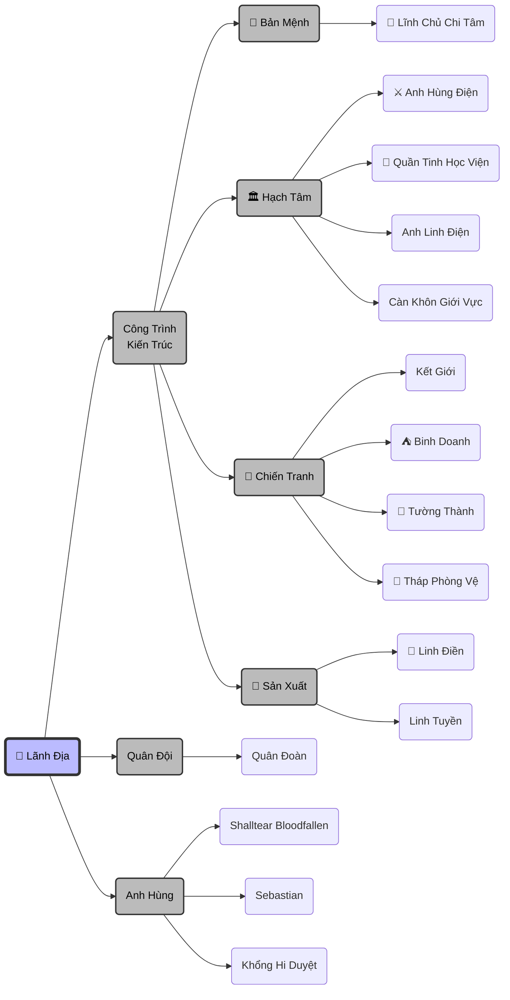

# LÃNH ĐỊA

## 1. Cơ Chế Vận Hành

> [!calculator]- **🧮 Quy Tắc Tăng Trưởng Lãnh Địa**
> **Công Thức Cốt Lõi**: `(Chỉ số Cơ Bản x Hệ Số Đột Phá) x (Chỉ số Thống Soái x 0.5%) x Hệ Số Phẩm Chất`
>
> **1. Hệ Số Phẩm Chất:**
> - Tuyệt Cao Vô Thượng: **x1.000**
>
> **2. Bảng Tăng Trưởng Cơ Bản:**
> 
> | Giai Đoạn | Dân/Cấp | Diện Tích/Cấp | Phần Thưởng Đột Phá |
> | :--- | :--- | :--- | :--- |
> | **LV. 1 - 10** | +10 | +1.000 m² | *Dân số x2, Diện tích x5* |
> | **LV. 11 - 100** | +100 | +10.000 m² | *Dân số x3, Diện tích x10* |
> | **LV. 101 - 1.000** | +1.000 | +100.000 m² | *Dân số x5, Diện tích x100* |
> | **LV. 1.001 - 10.000** | +10.000 | +1.000.000 m² | *Dân số x10, Diện tích x1.000* |

## 2. Quản Lý Lãnh Địa

## 3. Cấu Trúc Không Gian
> [!info] **Mô Hình: Thập Trùng Thiên**
> Lãnh địa không mở rộng trên một mặt phẳng, mà xếp chồng lên nhau thành tháp không gian.
>
> **Tầng 10: Vĩnh Hằng Thần Đô**
> - **Chủ nhân:** Nơi ở của Lãnh Chúa & Gia quyến.
> - **Kiến trúc:** Một tòa Tiên Cung lơ lửng, xung quanh là biển mây và các vì sao nhân tạo.
> - **Đặc quyền:** Nồng độ năng lượng gấp 10000 lần các tầng Bát Hoang Tinh Vực.
>
> **Tầng 2 ➔ 9: Bát Hoang Tinh Vực**
> - **Cấu trúc:** 8 Lục địa khổng lồ bay xung quanh trục chính (Thần Đô) với tâm là các tinh cầu, mô phỏng quỹ đạo hành tinh.
> - **Chức năng:** Khu vực của Tướng lĩnh, Quân đội tinh nhuệ,  Các chủng tộc cao cấp.
> - **Đặc quyền:** Nồng độ năng lượng gấp 1000 lần tầng Khởi Nguyên Đại Lục.
>
> **Tầng 1: Khởi Nguyên Đại Lục**
> - **Cấu trúc:** Một siêu lục địa trải dài vô tận làm nền móng.
> - **Chức năng:** Nơi sinh sống của hàng tỷ dân thường, sản xuất nông nghiệp, khai thác tài nguyên cơ bản.