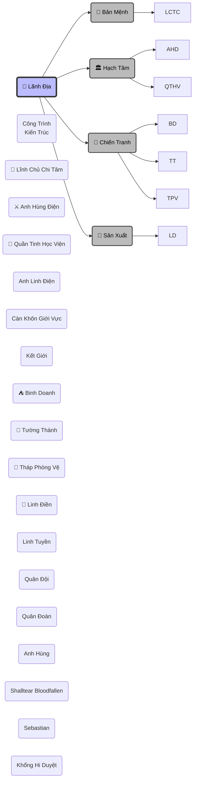

## 1. Cơ Chế Vận Hành

> [!calculator]- Quy Tắc
>  ![[HỆ THỐNG THIẾT LẬP#3. 🏰 LÃNH ĐỊA]]

## 2. Quản Lý Lãnh Địa

## 3. Cấu Trúc Không Gian
> [!info] **Mô Hình: Thập Trùng Thiên**
> Lãnh địa không mở rộng trên một mặt phẳng, mà xếp chồng lên nhau thành tháp không gian.
>
> **Tầng 10: Vĩnh Hằng Thần Đô**
> - **Chủ nhân:** Nơi ở của Lãnh Chúa & Gia quyến.
> - **Kiến trúc:** Một tòa Tiên Cung lơ lửng, xung quanh là biển mây và các vì sao nhân tạo.
> - **Đặc quyền:** Nồng độ năng lượng gấp 10000 lần các tầng Bát Hoang Tinh Vực.
>
> **Tầng 2 ➔ 9: Bát Hoang Tinh Vực**
> - **Cấu trúc:** 8 Lục địa khổng lồ bay xung quanh trục chính (Thần Đô) với tâm là các tinh cầu, mô phỏng quỹ đạo hành tinh.
> - **Chức năng:** Khu vực của Tướng lĩnh, Quân đội tinh nhuệ,  Các chủng tộc cao cấp.
> - - **Đặc quyền:** Nồng độ năng lượng gấp 1000 lần tầng Khởi Nguyên Đại Lục.
>
> **Tầng 1: Khởi Nguyên Đại Lục**
> - **Cấu trúc:** Một siêu lục địa trải dài vô tận làm nền móng.
> - **Chức năng:** Nơi sinh sống của hàng tỷ dân thường, sản xuất nông nghiệp, khai thác tài nguyên cơ bản.