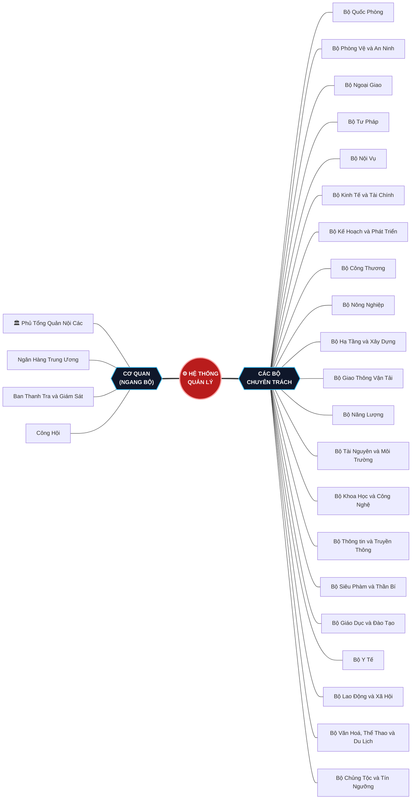

# HỆ THỐNG QUẢN LÝ

```mermaid
flowchart LR
	%% ===== ĐỊNH DẠNG NODE TRUNG TÂM =====
	HTQL(("⚙️ HỆ THỐNG<br>QUẢN LÝ")) 
	
    %% ===== NHÁNH TRÁI: CƠ QUAN NGANG BỘ =====
    CQ{{"CƠ QUAN<br>(NGANG BỘ)"}}
    
    CQ === HTQL
    
    CQ1["🏛️ Phủ Tổng Quản Nội Các"] --- CQ
    CQ2["Ngân Hàng Trung Ương"] --- CQ
    CQ3["Ban Thanh Tra và Giám Sát"] --- CQ
    CQ4["Công Hội"] --- CQ
    
    %% ===== NHÁNH PHẢI: CÁC BỘ =====
    B{{"CÁC BỘ<br>CHUYÊN TRÁCH"}}
    
    HTQL === B
    
    B --- B1["Bộ Quốc Phòng"]
    B --- B2["Bộ Phòng Vệ và An Ninh"]
    B --- B3["Bộ Ngoại Giao"]
    B --- B4["Bộ Tư Pháp"]
    B --- B5["Bộ Nội Vụ"]
    B --- B6["Bộ Kinh Tế và Tài Chính"]
    B --- B7["Bộ Kế Hoạch và Phát Triển"]
    B --- B8["Bộ Công Thương"]
    B --- B9["Bộ Nông Nghiệp"]
    B --- B10["Bộ Hạ Tầng và Xây Dựng"]
    B --- B11["Bộ Giao Thông Vận Tải"]
    B --- B12["Bộ Năng Lượng"]
    B --- B13["Bộ Tài Nguyên và Môi Trường"]
    B --- B14["Bộ Khoa Học và Công Nghệ"]
    B --- B15["Bộ Thông tin và Truyền Thông"]
    B --- B16["Bộ Siêu Phàm và Thần Bí"]
    B --- B17["Bộ Giáo Dục và Đào Tạo"]
    B --- B18["Bộ Y Tế"]
    B --- B19["Bộ Lao Động và Xã Hội"]
    B --- B20["Bộ Văn Hoá, Thể Thao và Du Lịch"]
    B --- B21["Bộ Chủng Tộc và Tín Ngưỡng"]

    %% CSS ĐỊNH DẠNG MÀU SẮC & BO GÓC
    classDef centerNode fill:#b91c1c,stroke:#fca5a5,stroke-width:3px,color:#fff,font-weight:bold;
    classDef groupNode fill:#0f172a,stroke:#38bdf8,stroke-width:2px,color:#fff,font-weight:bold;
    classDef linkNode fill:#1e293b,stroke:#64748b,stroke-width:1px,color:#60a5fa,font-weight:bold,cursor:pointer;
    
    class HTQL centerNode;
    class CQ,B groupNode;
    class CQ1,CQ2,CQ3,CQ4,B1,B2,B3,B4,B5,B6,B7,B8,B9,B10,B11,B12,B13,B14,B15,B16,B17,B18,B19,B20,B21 internal-link,linkNode;
```
